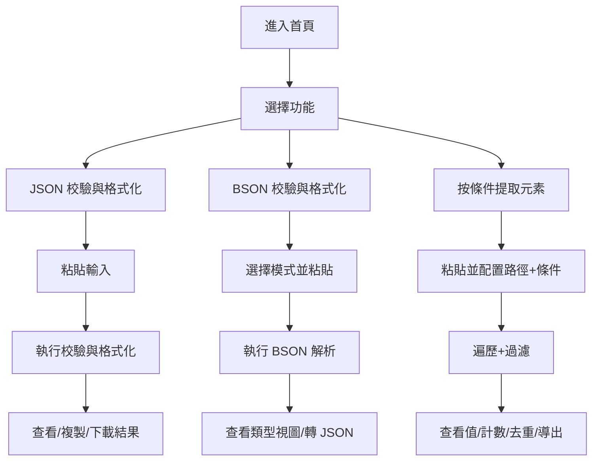

# 大狼狗 JSON 在線格式化網站 — 產品需求文檔（PRD）

## 1. 產品概述

「大狼狗 JSON 在線格式化網站」是一個面向開發者、數據分析師及後端工程師的純前端靜態工具站，提供 JSON 校驗格式化、BSON 校驗格式化以及「按條件提取元素」三項核心能力，無需登錄、無需後端，打開即用。

- 主要解決問題：日常開發、接口聯調、BSON 文檔檢視與數據抽樣統計場景下，重複依賴在線服務或 IDE 插件效率低下的痛點。
- 目標用戶：Java / Node / 全棧工程師、數據分析師、QA、運維，以及需要批量提取 JSON/BSON 字段的業務人員。
- 產品定位：輕量、安全、可離線運行的「瀏覽器端 JSON/BSON 工具箱」，作者 Moshow。

## 2. 核心功能

### 2.1 用戶角色

本產品無需註冊登錄，所有用戶角色統一為「訪客用戶」，享有相同功能權限。

| 角色 | 註冊方式 | 核心權限 |
|------|----------|----------|
| 訪客用戶 | 無需註冊 | 使用三大核心功能、本地保存、複製/下載結果 |

### 2.2 功能模塊

1. **首頁 / 工具總覽頁**：站點介紹、頂部導航、三大功能入口卡片、頁腳版權信息。
2. **JSON 校驗與格式化頁**：左輸入右輸出、縮進選擇、校驗狀態、壓縮/美化/轉義。
3. **BSON 校驗與格式化頁**：支持 MongoDB Extended JSON 與十六進制 BSON 解析、類型提示、可切換到 JSON 視圖。
4. **元素提取頁（Extract by Condition）**：基於「路徑 + 條件表達式」從 JSON/BSON 中提取同層/嵌套下的元素，支持去重、計數、結果分組與導出。

### 2.3 頁面詳情

| 頁面名稱 | 模塊名稱 | 功能描述 |
|----------|----------|----------|
| 首頁 | Hero 區 | 站名、slogan「打開即用的 JSON/BSON 工具箱」、當前功能總數標識 |
| 首頁 | 功能卡片區 | 3 個並排卡片，分別跳轉到 JSON、BSON、Extract 頁 |
| 首頁 | 使用說明區 | 簡要文字+圖標，說明純前端、零上傳、零追蹤 |
| JSON 頁 | 輸入面板 | Monaco-like（用 textarea + 高亮層）輸入區，支持粘貼、拖拽、示例載入 |
| JSON 頁 | 控制條 | 縮進（2/4/Tab）、壓縮/美化/排序鍵/轉義 Unicode 開關 |
| JSON 頁 | 輸出面板 | 高亮格式化結果、校驗狀態徽章（成功/失敗/錯誤位置） |
| JSON 頁 | 操作工具欄 | 複製結果、下載 .json、清空、交換左右 |
| BSON 頁 | 模式切換 | 切換「Extended JSON / Hex String / Base64」三種輸入模式 |
| BSON 頁 | 類型視圖 | 解析後以表格展示 `_id`、`Date`、`NumberLong`、`ObjectId` 等 BSON 類型 |
| BSON 頁 | 轉 JSON | 一鍵轉為標準 JSON 並跳轉到 JSON 頁輸出 |
| 提取頁 | 條件構造器 | 輸入 JSON/BSON，配置「目標路徑（如 `accounts[*].accountNumber`）」+「過濾條件（如 `accountLocation == "CN"`）」 |
| 提取頁 | 結果面板 | 顯示提取值列表、每個值出現次數、去重後集合、總條數 |
| 提取頁 | 高級選項 | 區分大小寫、深度優先/廣度優先、保留路徑、僅取標量/包含對象 |
| 提取頁 | 導出 | 複製為 JSON 數組、下載 CSV |
| 全站 | 頂部導航 | Logo、JSON / BSON / Extract 鏈接、深淺色切換 |
| 全站 | 頁腳 | 作者 Moshow、版權、GitHub / 郵箱鏈接 |
| 全站 | 通用 | 錯誤提示 Toast、快捷鍵（Ctrl+Enter 執行、Ctrl+K 清空） |

## 3. 核心流程

### 3.1 JSON 校驗與格式化流程
1. 用戶粘貼或拖入 JSON 文本到左側輸入框（或點擊「載入示例」）。
2. 點擊「格式化」或輸入即時觸發校驗。
3. 校驗通過：右側輸出格式化後結果，狀態徽章為綠色「Valid」。
4. 校驗失敗：右側顯示錯誤位置（行:列）與錯誤信息，狀態徽章為紅色「Invalid」。
5. 用戶可複製、下載或清空結果。

### 3.2 BSON 校驗與格式化流程
1. 用戶選擇輸入模式（Extended JSON / Hex / Base64）並粘貼內容。
2. 點擊「解析」後，系統調用瀏覽器端 BSON 解析器（`bson` 或自實現）。
3. 解析成功：以 BSON 類型視圖呈現，並提供「轉為 JSON」按鈕。
4. 解析失敗：顯示錯誤原因（如非法的 ObjectId、截斷的 hex）。
5. 用戶可在 JSON / BSON 視圖間切換。

### 3.3 按條件提取元素流程
1. 用戶粘貼 JSON/BSON 到提取頁輸入框。
2. 配置「目標路徑」（如 `accounts[*].accountNumber`）和「過濾條件」（如 `accountLocation == "CN"`）。
3. 點擊「提取」，系統遍歷所有匹配路徑的元素並按過濾條件篩選。
4. 結果面板展示：值列表、計數表、去重集合、命中路徑樹。
5. 用戶可選擇去重、複製為 JSON 數組或下載 CSV。

## 4. 用戶界面設計

### 4.1 設計風格

整體採用「莊重、正式的政府/協會類企業站風格」，避免花哨的漸變和卡通化插畫。

- **主色**：深藍 `#0B2A4A`（標題、頂欄）、點睛橙 `#C8A24B`（按鈕、強調）。
- **輔色**：中灰 `#5B6770`（正文）、淺灰背景 `#F5F6F8`、警示紅 `#B3261E`、成功綠 `#1E7A3C`。
- **按鈕風格**：直角圓角（4px）、實心 + 描邊雙風格，帶輕微陰影與按下態。
- **字體**：
  - 中文：`Noto Serif SC`（標題）、`Noto Sans SC`（正文）。
  - 英文/代碼：`JetBrains Mono`（代碼）、`Source Serif 4`（英文標題）。
- **佈局**：頂部固定導航（高度 64px），主內容最大寬度 1200px 居中，卡片式分區，網格 12 列。
- **圖標**：Bootstrap Icons（線性、單色），禁用 emoji 作為 UI 元素。
- **質感**：細 1px 邊框 + 柔和陰影 + 細微的紙紋背景（SVG noise 透明度 ≤ 4%）。

### 4.2 頁面設計概覽

| 頁面名稱 | 模塊名稱 | UI 元素 |
|----------|----------|---------|
| 首頁 | Hero | 居中標題、副標題、雙 CTA 按鈕、底部分隔線 |
| 首頁 | 功能卡片 | 3 列卡片，左側 ICON + 標題 + 簡述 + 「開始使用 →」 |
| JSON 頁 | 雙欄佈局 | 左 50% 輸入框（行號），右 50% 輸出框（高亮），上方控制條 |
| JSON 頁 | 狀態徽章 | 圓角膠囊，Valid 綠 / Invalid 紅 / Warning 黃 |
| BSON 頁 | 模式切換 | Segmented Control（線性分段控件） |
| BSON 頁 | 類型表 | 表格，類型列用 Badge 區分 `ObjectId`/`Date`/`Int32` 等 |
| 提取頁 | 條件構造器 | 兩行表單：路徑輸入框 + 條件輸入框 + 高級選項折疊面板 |
| 提取頁 | 結果分組 | Tabs：值列表 / 計數表 / 去重集合 / 命中路徑 |
| 全站 | 頂欄 | Logo + 站名 + 3 個鏈接 + 主題切換 |
| 全站 | 頁腳 | 細線分隔，三列：關於 / 鏈接 / 版權 |

### 4.3 響應式

- 桌面優先（≥ 1200px），向下兼容平板（≥ 768px）和手機（≥ 360px）。
- JSON/BSON 頁雙欄在 < 992px 時縱向堆疊為上下佈局，工具欄始終 sticky 在頂部。
- 提取頁條件構造器在手機端折疊為單列。

### 4.4 動效與微交互

- 頁面進入：標題與卡片以 60ms 為單位階梯式淡入（最多 8 級）。
- 按鈕 hover：背景色加深 8% + 陰影上移 2px（200ms ease-out）。
- 校驗狀態變化：徽章顏色 250ms 過渡，無閃爍。
- 代碼高亮切換：採用 CSS 變量切換淺色 / 深色主題，無重渲染。
