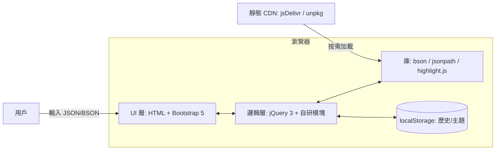
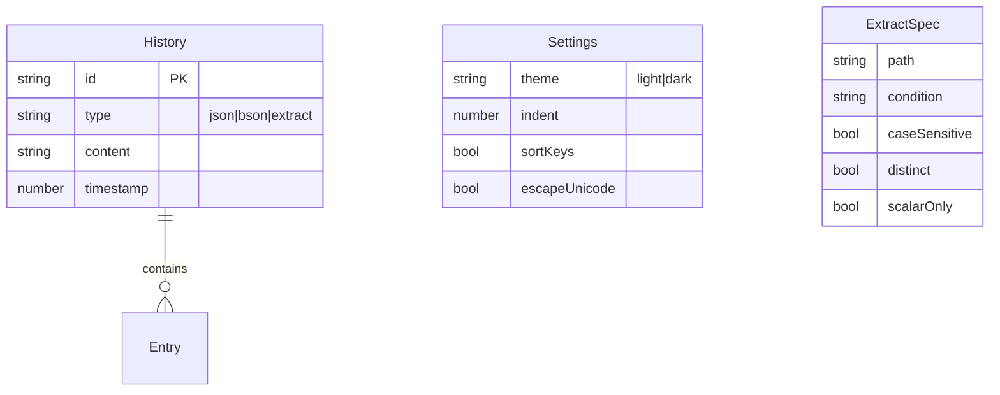

# 大狼狗 JSON 在線格式化網站 — 技術架構文檔

## 1. 架構設計

整站採用「純靜態前端 + 瀏覽器端庫 + CDN 分發」的三層架構，所有計算在用戶瀏覽器內完成，零後端、零上傳、零追蹤。



## 2. 技術選型

| 層次 | 選型 | 說明 |
|------|------|------|
| UI 框架 | Bootstrap 5.3（CDN） | 響應式柵格、組件、工具類 |
| DOM 與交互 | jQuery 3.7（CDN） | 簡化事件、AJAX（如需）、DOM 操作 |
| 代碼高亮 | highlight.js 11（CDN） | JSON/BSON/Mongo Extended JSON 著色 |
| BSON 解析 | bson 6.x（瀏覽器 ESM 版，CDN） | 解析/序列化 Extended JSON、Hex、Base64 |
| JSON 路徑 | jsonpath 1.1（自研簡化版） | 從 JSON/BSON 提取元素，支持 `[*]`、`..`、表達式過濾 |
| 主題切換 | CSS 變量 + `data-bs-theme` | 淺色 / 深色 |
| 字體 | Google Fonts: Noto Serif SC / Noto Sans SC / JetBrains Mono / Source Serif 4 | 中文標題 + 英文標題 + 代碼字體 |
| 圖標 | Bootstrap Icons（CDN） | 線性單色 |
| 構建 | 無構建（純靜態文件） | 直接部署到任何靜態服務器 |
| 託管 | GitHub Pages / Nginx / 對象存儲 | 純靜態，無服務器端邏輯 |

### 2.1 為什麼選擇 jQuery 3 + Bootstrap 5
- 用戶明確指定技術棧；
- 輕量靜態站點，無需重型框架（React/Vue）；
- Bootstrap 5 已不依賴 jQuery，但本項目刻意保留 jQuery 以簡化 DOM 操作與事件處理；
- 全站打包後 gzip < 200KB，CDN 加載迅速。

## 3. 路由與頁面結構

採用「單頁 + Hash 路由」模式，所有功能集成於 `index.html`，通過 `location.hash` 切換視圖，無需服務器端路由配置。

| 路由（hash） | 頁面 | 入口函數 |
|--------------|------|----------|
| `#/` | 首頁（Hero + 功能卡片 + 說明） | `router.home()` |
| `#/json` | JSON 校驗與格式化 | `router.jsonTool()` |
| `#/bson` | BSON 校驗與格式化 | `router.bsonTool()` |
| `#/extract` | 按條件提取元素 | `router.extractTool()` |
| `#/about` | 關於頁（站點簡介、作者、版本） | `router.about()` |

### 3.1 模塊劃分
```
/index.html
/assets/
  /css/
    site.css            # 站點主題、佈局、組件樣式
    token.css           # 設計 token（顏色、字體、間距）
  /js/
    main.js             # 入口、路由、頂欄/頁腳渲染
    modules/
      json.js           # JSON 校驗/格式化邏輯
      bson.js           # BSON 解析/格式化邏輯
      extract.js        # 路徑匹配 + 條件過濾 + 計數
      storage.js        # localStorage 封裝
      ui.js             # Toast / Modal / 主題切換
    vendor/
      jquery.min.js     # 第三方：可選本地化
      bootstrap.bundle.min.js
      highlight.min.js
      bson.browser.min.js
      bootstrap-icons.css
  /img/
    logo.svg
    favicon.ico
```

## 4. API 定義

本項目無後端 API，所有「API」均為前端內部模塊函數，定義如下（TypeScript 風格的偽類型）：

```ts
// JSON 模塊
type FormatOptions = {
  indent: number | '\t';          // 縮進空格數或製表符
  sortKeys: boolean;              // 是否按鍵名排序
  escapeUnicode: boolean;         // 是否轉義非 ASCII
};
type JsonValidateResult =
  | { ok: true; data: unknown }
  | { ok: false; error: { message: string; line: number; column: number } };
function formatJson(input: string, opts: FormatOptions): JsonValidateResult;
function minifyJson(input: string): JsonValidateResult;

// BSON 模塊
type BsonMode = 'extended-json' | 'hex' | 'base64';
type BsonParseResult =
  | { ok: true; doc: object; types: Array<{ path: string; bsonType: string }> }
  | { ok: false; error: string };
function parseBson(input: string, mode: BsonMode): BsonParseResult;
function bsonToJson(input: string, mode: BsonMode): JsonValidateResult;

// 提取模塊
type ExtractSpec = {
  path: string;                   // 例：accounts[*].accountNumber 或 $.accounts..accountNumber
  condition?: string;             // 例：accountLocation == "CN" && status == "ACTIVE"
  caseSensitive?: boolean;
  distinct?: boolean;             // 是否去重
  scalarOnly?: boolean;           // 僅取標量
};
type ExtractResult = {
  total: number;
  values: Array<{ value: unknown; count: number; paths: string[] }>;
  distinct: unknown[];
  matches: Array<{ path: string; value: unknown }>;
};
function extract(json: string, spec: ExtractSpec): ExtractResult;
```

## 5. 服務端架構

無服務端。所有處理在瀏覽器內完成，符合「零上傳、零追蹤」的隱私原則。

## 6. 數據模型

### 6.1 數據模型定義



### 6.2 存儲結構（localStorage Key 定義）

| Key | 類型 | 說明 |
|-----|------|------|
| `dlg.theme` | `'light' \| 'dark'` | 主題 |
| `dlg.settings` | JSON | 用戶偏好（縮進、排序等） |
| `dlg.history` | JSON 數組 | 最近 20 條輸入（脫敏後） |
| `dlg.lastSpec` | JSON | 提取頁最後一次配置 |

### 6.3 初始化數據（內置示例）
- `examples/user-accounts.json`：包含 `accounts[*].accountNumber` / `accountLocation` / `balance` 等，便於一鍵演示「提取 CN 賬號並計數」。
- `examples/order-bson.json`：MongoDB Extended JSON 示例，演示 BSON 類型視圖。

## 7. 性能與可訪問性

- 首次加載關鍵資源預連接（`<link rel="preconnect">`）jsDelivr / Google Fonts。
- 大於 1MB 的輸入提示用戶並分塊處理，避免主線程阻塞。
- 所有交互元素提供 `aria-label` / `role`；鍵盤快捷鍵：`Ctrl+Enter` 執行、`Ctrl+K` 清空、`Ctrl+/` 切換主題。
- Lighthouse 目標：Performance ≥ 90、Accessibility ≥ 95、Best Practices ≥ 95、SEO ≥ 90。

## 8. 安全與隱私

- 純前端：所有輸入輸出均在瀏覽器內，不發起任何網絡請求（CDN 資源加載除外）。
- 不使用第三方統計/分析腳本。
- localStorage 僅保存用戶主動確認的歷史，且不保存敏感字段（提供「脫敏保存」開關）。

## 9. 部署

- 直接將項目根目錄上傳到任意靜態託管（GitHub Pages / Nginx / 阿里雲 OSS / 騰訊雲 COS）。
- 推薦綁定自定義域名並開啟 HTTPS（HSTS 1 年）。
- 提供 `robots.txt` 與 `sitemap.xml`，便於搜索引擎收錄。
