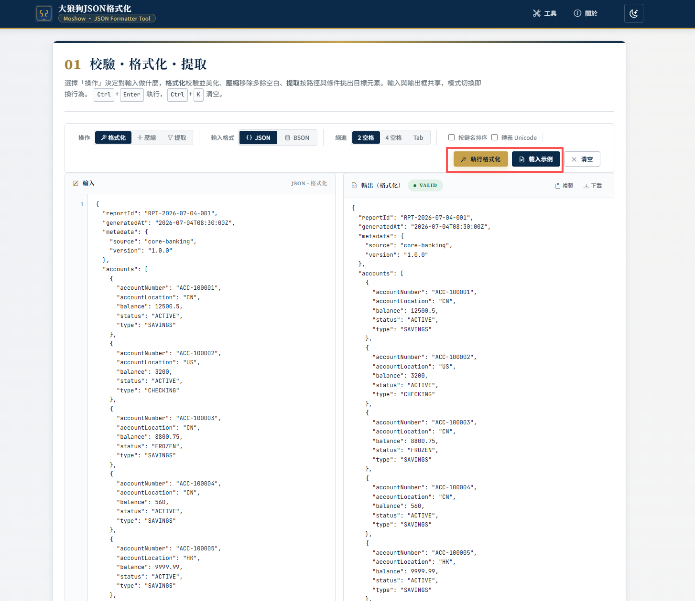
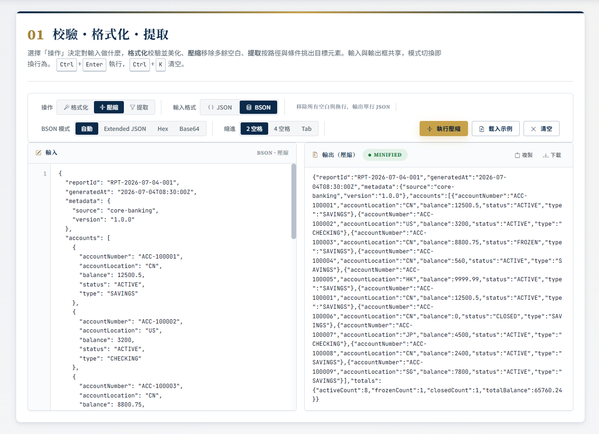
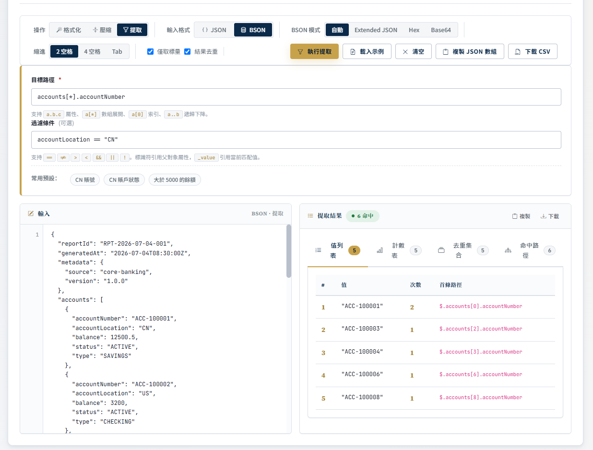

# 大狼狗 JSON 格式化 — Moshow · JSON Formatter Tool

> 一個面向開發者、數據分析師與後端工程師的 **純前端** JSON / BSON 工具箱。
> 打開即用、零上傳、零追蹤，集成 **校驗格式化 / 壓縮 / 按條件提取** 三項核心能力。

🔗 線上使用：[大狼狗JSON格式化在线工具](https://moshowgame.github.io/online-json-format/) [https://moshowgame.github.io/online-json-format/](https://moshowgame.github.io/online-json-format/)

效果:

| 功能 | 預覽 | 說明 |
|:---|:---:|---|
| 校驗格式化 |  | 縮進 / 排序 / 轉義 / 錯誤定位 |
| 壓縮 |  | 單行輸出,體積最小 |
| 提取元素 |  | 路徑 + 條件,支持去重 / 計數 / 導出 |

---

## 👤 作者

**Moshow** — Technical Lead & 數據科學家 & SpringBoot 專家

- 🏆 CSDN 博客之星 2025 年度 TOP100 — [https://zhengkai.blog.csdn.net/](https://zhengkai.blog.csdn.net/)
- ⭐ GitHub 4K stars — [https://github.com/moshowgame](https://github.com/moshowgame)
---

## ✨ 特性

- **一框三用**：同一個輸入框支援「**格式化** / **壓縮** / **提取元素**」三種操作，模式切換即換行為。
- **純前端**：所有計算在瀏覽器內完成，您的數據從不離開本機。
- **零追蹤**：不集成任何分析或廣告腳本、不寫入 Cookie。
- **BSON 友好**：支持 **Extended JSON / Hex / Base64** 三種輸入模式，自動識別 `ObjectId` / `Date` / `NumberLong` / `NumberDecimal` 等 BSON 類型。
- **元素提取**：基於「**路徑** + **條件表達式**」從 JSON/BSON 中提取目標元素，支持去重、計數、命中路徑與父對象詳情。
- **鍵盤友好**：`Ctrl + Enter` 執行、`Ctrl + K` 清空、`Ctrl + /` 切換主題。
- **響應式**：桌面 / 平板 / 手機自適配，工具欄始終 sticky 在頂部。
- **可離線**：除 Google Fonts / 第三方 CDN 外，主站靜態文件可直接本地打開。

---

## 🛠️ 技術棧

| 層次 | 選型 | 用途 |
|------|------|------|
| UI 框架 | [Bootstrap 5.3](https://getbootstrap.com/) | 柵格佈局、組件、響應式工具類 |
| DOM / 交互 | [jQuery 3.7](https://jquery.com/) | 事件綁定、DOM 操作 |
| 代碼高亮 | [highlight.js 11](https://highlightjs.org/) | JSON / BSON 語法著色 |
| BSON 解析 | [bson 6.x](https://www.npmjs.com/package/bson) | 解析 / 序列化 Extended JSON、Hex、Base64 |
| JSON 路徑 | 自研簡化版 | 支援 `a.b.c` / `a[*]` / `a[0]` / `a..b` 遞迴下降 |
| 主題切換 | CSS 變量 + `data-bs-theme` | 淺色 / 深色 |
| 字體 | Google Fonts | Noto Serif SC / Noto Sans SC / JetBrains Mono / Source Serif 4 |
| 圖標 | Bootstrap Icons | 線性單色 |
| 構建 | **無構建**（純靜態文件） | 直接部署到任何靜態服務器 |

---

## 📁 項目結構

```
moshow-json-format/
├── index.html                  # 入口頁（單頁應用，集成所有功能）
├── robots.txt
├── sitemap.xml
├── examples/                   # 示例 JSON / BSON 文件
│   ├── order-bson.json
│   └── user-accounts.json
└── assets/
    ├── css/
    │   ├── token.css           # 設計 token（顏色 / 字體 / 間距 / 圓角）
    │   └── site.css            # 站點主題、佈局、組件樣式
    ├── img/
    │   └── logo.svg
    └── js/
        ├── main.js             # 入口、頂欄 / 頁腳渲染、模式切換
        └── modules/
            ├── storage.js      # localStorage 封裝
            ├── ui.js           # Toast / 主題切換 / 細節面板
            ├── json.js         # JSON 校驗 / 格式化 / 壓縮
            ├── bson.js         # BSON 解析 / 格式化 / 類型摘要
            └── extract.js      # 路徑匹配 + 條件過濾 + 計數 / 去重
```

---

## 🚀 本地運行

無需構建工具，任意靜態服務器即可：

```bash
# Python 3
python3 -m http.server 8765

# Node.js (需先 npm i -g http-server)
http-server -p 8765

# VS Code
# 安裝 Live Server 插件，右鍵 index.html → Open with Live Server
```

打開 [http://localhost:8765](http://localhost:8765) 即可。

> 也可以直接雙擊 `index.html` 用瀏覽器打開（`file://` 協議下大部分功能仍可用）。

---

## ⌨️ 鍵盤快捷鍵

| 快捷鍵 | 動作 |
|--------|------|
| `Ctrl` + `Enter` | 執行當前操作（格式化 / 壓縮 / 提取） |
| `Ctrl` + `K` | 清空輸入與輸出 |
| `Ctrl` + `/` | 切換深色 / 淺色主題 |

---

## 🎨 設計 Token

設計語言：莊重、正式的政府 / 協會類企業站風格。

**淺色主題（light）**
- 主色：深藍 `#0B2A4A`（標題、頂欄）
- 點睛色：琥珀金 `#C8A24B`（按鈕、強調）
- 背景：淺灰 `#F5F6F8` / 純白 `#FFFFFF`
- 圓角：md `6px` / lg `10px`

**深色主題（dark）**
- 主色：深石板 `#1A1F2A`（頂欄 / 頁腳）
- 點睛色：沉穩琥珀金 `#C9A961`
- 背景：近黑 `#0E141C` / 深灰 `#161E29`

更多 token 見 [`assets/css/token.css`](assets/css/token.css)。

---

## 🧩 三大核心操作

### 1️⃣ 校驗・格式化（format）
- 縮進：**2 空格** / **4 空格** / **Tab**
- 選項：按鍵名排序、轉義 Unicode
- 校驗失敗時顯示錯誤位置（行 : 列）與錯誤信息

### 2️⃣ 壓縮（minify）
- 移除所有空白與換行，輸出單行 JSON

### 3️⃣ 提取元素（extract）
- **路徑語法**:`a.b.c` / `a[*]` / `a[0]` / `a..b` 遞迴下降
- **自動偵測**:只輸入一個屬性名(如 `accountNumber`),自動掃描所有出現位置,把同模板路徑聚合為 `accounts[*].accountNumber`,點擊即套用
- **條件表達式**:`==` `!=` `>` `<` `&&` `||` `!`;標識符引用父對象屬性;`_value` 引用當前匹配值
- **預設**:「CN 賬號」「大於 5000 的餘額」等一鍵套用
- **結果**:值列表、計數表、去重集合、命中路徑、父對象詳情
- **導出**:複製為 JSON 數組、下載 CSV

---

## 🔒 隱私承諾

- ❌ 不收集任何用戶數據
- ❌ 不寫入 Cookie（除必要的 `localStorage` 主題偏好）
- ❌ 不與第三方共享信息
- ❌ 不集成任何分析或廣告腳本
- ✅ 所有計算 100% 在您的瀏覽器內完成

---

## 📦 部署

純靜態站點，可部署到任何靜態服務器：

- **GitHub Pages** / **Vercel** / **Netlify** / **Cloudflare Pages**：直接推送到倉庫即可
- **Nginx** / **Apache**：將整個目錄作為站點根目錄
- **對象存儲**：OSS / S3 / COS 配置靜態網站託管

> 已附帶 `robots.txt` 與 `sitemap.xml`，SEO 友好。


---

## 📄 許可證

© 2026 Moshow · 大狼狗JSON格式化 · All Rights Reserved.
